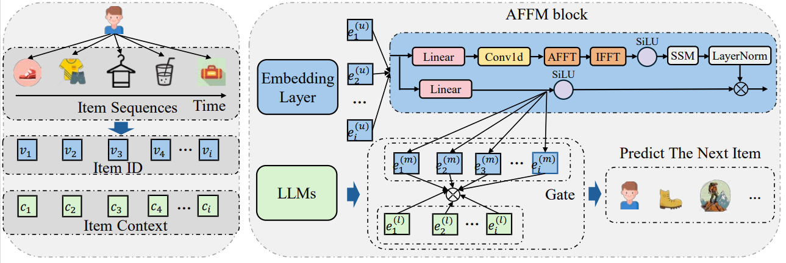
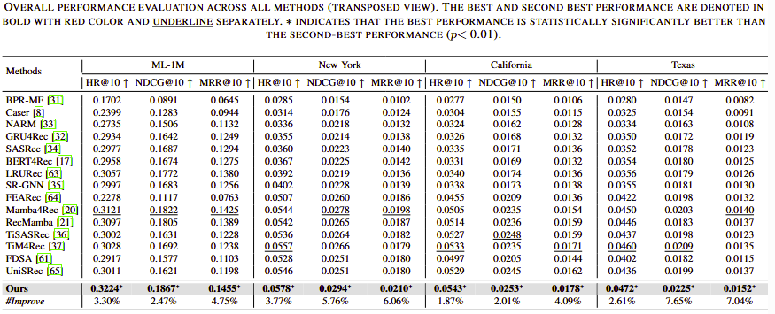

# M2Rec
## M2Rec: Multi-scale Mamba for Efficient Sequential Recommendation

Sequential recommendation systems aim to predict users' next preferences based on their interaction histories, but existing approaches face critical limitations in efficiency and multi-scale pattern recognition. While Transformer-based methods struggle with quadratic computational complexity, recent Mamba-based models improve efficiency but fail to capture periodic user behaviors, leverage rich semantic information, or effectively fuse multimodal features. To address these challenges, we propose M2Rec, a novel sequential recommendation framework that integrates multi-scale Mamba with Fourier analysis, Large Language Models (LLMs), and adaptive gating. First, we enhance Mamba with Fast Fourier Transform (FFT) to explicitly model periodic patterns in the frequency domain, separating meaningful trends from noise. Second, we incorporate LLM-based text embeddings to enrich sparse interaction data with semantic context from item descriptions. Finally, we introduce a learnable gate mechanism to dynamically balance temporal (Mamba), frequency (FFT), and semantic (LLM) features, ensuring harmonious multimodal fusion. Extensive experiments demonstrate that M2Rec achieves state-of-the-art performance, improving Hit Rate@10 by 3.2\% over existing Mamba-based models while maintaining 20\% faster inference than Transformer baselines. Our results highlight the effectiveness of combining frequency analysis, semantic understanding, and adaptive fusion for sequential recommendation.

### Configuration


### Performance


### Requirements

* Python 3.7+
* PyTorch 1.12+
* CUDA 11.6+
* Install RecBole:
  * `pip install recbole`
* Install causal Conv1d and the core Mamba package:
  * `pip install causal-conv1d>=1.2.0`
  * `pip install mamba-ssm`

You can also refer to the required environment specifications in `environment.yaml`.

### Run

```python run_mm.py```


Specifying the dataset in `config.yaml` will trigger an automatic download. Please set an appropriate maximum sequence length in `config.yaml` for each dataset before training.
